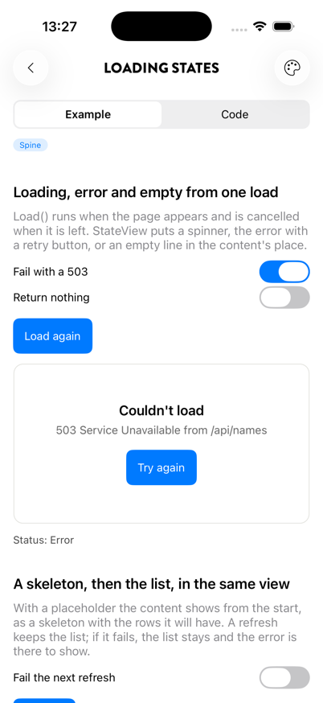
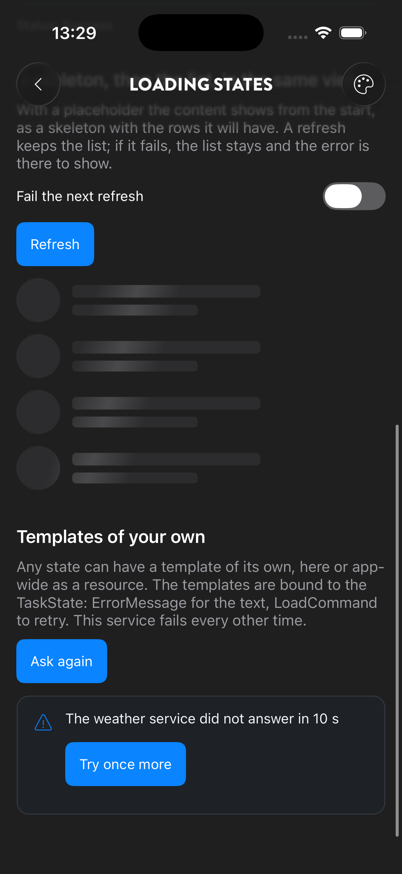

# Loading states: TaskState and StateView

Part of the core package, `Plugin.Maui.Spine`.

Almost every page loads something, and each one needs the same four states: loading, the content, an error with a way to retry, and "nothing here". `TaskState<T>` is one async load and where it is. `StateView` shows the page's content, or one of the other states in its place.

```csharp
public partial class CompetitionsPageViewModel : ViewModelBase
{
    public TaskState<IReadOnlyList<Competition>> Competitions { get; }

    public CompetitionsPageViewModel(ICompetitionsApi api)
    {
        // Runs when the page appears, cancelled when it is left.
        Competitions = Load(ct => api.GetCompetitionsAsync(ct), isEmpty: list => list.Count == 0);
    }
}
```

```xml
<StateView State="{Binding Competitions}">
    <CollectionView ItemsSource="{Binding Competitions.Value}" />
</StateView>
```

That is the whole page: a spinner while it loads, the list when it arrives, "Couldn't load" with the error's message and a **Try again** button if it fails, and "Nothing here yet" for an empty list.

<p align="center">
  
  
</p>
<p align="center"><sub>The default error state; a skeleton from a placeholder in the dark theme</sub></p>

The Spine Showcase has a **Loading states** page with each case.

---

## Platforms

| Platform | Status |
|---|---|
| iOS | ✅ Supported |
| Android | ✅ Supported |
| Mac Catalyst | ✅ Supported, built but exercised less than iOS |
| Windows (WinUI 3) | ✅ Compiles in CI; not run on a device yet |

Plain MAUI views, no native code.

---

## The load and the page

`ViewModelBase.Load(load, isEmpty, placeholder)` makes a `TaskState<T>` that lives with the page:

| When | What happens |
|---|---|
| The page appears for the first time | The load runs, with a token from `PageLifetime`. |
| The page disappears (navigated away, sheet closed, tab left) | The running load is cancelled; the status goes back to where it was. |
| The page appears again | It loads again if it has nothing to show: never loaded, cancelled before its first result, or failed. A page that already shows a result is left as it is. |
| `LoadCommand` / `LoadAsync()` | Loads again with the page's lifetime: the retry button, pull to refresh, a refresh button. |

To refresh a page that already has a result each time it comes back, call it yourself:

```csharp
public override Task OnResumedAsync() => Competitions.LoadAsync();
```

A `TaskState<T>` made with `new` has no page. Call `LoadAsync(ct)` with your own token.

### Status

| `Status` | Meaning | `StateView` shows |
|---|---|---|
| `NotStarted` | Nothing loaded yet, nothing running | the loading state |
| `Loading` | The first load is running | the loading state, or the content under a skeleton when there is a placeholder |
| `Refreshing` | A load is running while the last result stays | the content |
| `Success` | The last load gave a result | the content |
| `Empty` | The result is empty by `isEmpty` | the empty state |
| `Error` | The load failed and there is no earlier result | the error state |

Rules:

- **The last load wins.** Starting a load cancels the one that is running, and a load that was replaced changes nothing.
- **A refresh keeps the result.** With a result on screen, a new load is `Refreshing`. If it fails, `Error` is set but the status stays `Success` or `Empty`, so the list does not disappear. Show `HasError` / `ErrorMessage` somewhere if the user should know.
- **A cancellation is not an error.** It puts the status back where it was.
- **When what is loaded changes** (a filter, a search term), call `Reset()` and then `LoadAsync()`. The old result is dropped and the page shows the loading state instead of refreshing stale content.
- The load runs on the thread that started it. From the page lifecycle and from commands that is the UI thread, so the properties are set there.

### Properties to bind

| Property | Use |
|---|---|
| `Value` | The content: the result, or the placeholder until there is one. |
| `Result` | The last successful result only. |
| `IsLoading` | Nothing to show yet (`NotStarted` or `Loading`). Drives a skeleton. |
| `IsRefreshing` | A load is running over a result. For `RefreshView.IsRefreshing`; setting it does nothing. |
| `HasResult`, `HasError`, `Error`, `ErrorMessage` | The rest of the state, for pages that draw it themselves. |
| `LoadCommand` | Retry, refresh, pull to refresh. Runs alongside a running load and replaces it, so a `RefreshView` is never disabled by it. |

---

## StateView

The content is an ordinary child. It keeps the page's binding context, so it binds to `Competitions.Value` and reaches the page's commands directly. It is created once and hidden or shown, never rebuilt.

The loading, error and empty states are drawn from templates. Their binding context is the `TaskState`:

```xml
<StateView State="{Binding Forecast}">
    <StateView.ErrorTemplate>
        <DataTemplate x:DataType="TaskState">
            <VerticalStackLayout>
                <Label Text="{Binding ErrorMessage}" />
                <Button Text="Try once more" Command="{Binding LoadCommand}" />
            </VerticalStackLayout>
        </DataTemplate>
    </StateView.ErrorTemplate>
    <Label Text="{Binding Forecast.Value}" />
</StateView>
```

| Property | Default |
|---|---|
| `LoadingTemplate` | An `ActivityIndicator` in the app's accent, centred |
| `ErrorTemplate` | "Couldn't load", the error's message, a **Try again** button |
| `EmptyTemplate` | One line of text, centred |
| `EmptyText` | The line in the default empty state; `Spine.State.Empty.Title` from the strings when unset |

A template that is not set on the view comes from the application resources, keyed `DefaultStateViewLoadingTemplate`, `DefaultStateViewErrorTemplate` and `DefaultStateViewEmptyTemplate`. That gives one look across the app:

```xml
<!-- App.xaml -->
<DataTemplate x:Key="DefaultStateViewErrorTemplate" x:DataType="TaskState">
    …
</DataTemplate>
```

The default text uses these keys, in English and Swedish. An app overrides them in its own strings (see [Strings](strings.md)):

| Key | English |
|---|---|
| `Spine.State.Loading` | Loading (the spinner's screen-reader description) |
| `Spine.State.Error.Title` | Couldn't load |
| `Spine.State.Error.Retry` | Try again |
| `Spine.State.Empty.Title` | Nothing here yet |

The default error state shows the exception's message. A failure the user cannot see is a failure no one reports, so write messages your services throw with that in mind.

---

## Skeletons

With a `placeholder`, the content is shown from the start and the loading state is not. Bind [`Skeleton.IsActive`](shimmer.md) to `IsLoading` and the placeholder rows are drawn as a skeleton with the height the loaded list will have. When the result arrives, the same view shows it, so nothing jumps:

```csharp
People = Load(ct => api.GetPeopleAsync(ct),
    placeholder: () => [.. Enumerable.Repeat(Person.Empty, 4)]);
```

```xml
<StateView State="{Binding People}">
    <VerticalStackLayout Skeleton.IsActive="{Binding People.IsLoading}"
                         BindableLayout.ItemsSource="{Binding People.Value}">
        …
    </VerticalStackLayout>
</StateView>
```

`StateView` does not set `Skeleton.IsActive` itself. The skeleton is in `Plugin.Maui.Spine.Controls.Shimmer`, which depends on the core and not the other way round. `IsLoading` is false while `Refreshing`, so a refresh keeps the real content on screen.

## Pull to refresh

```xml
<StateView State="{Binding People}">
    <RefreshView IsRefreshing="{Binding People.IsRefreshing}" Command="{Binding People.LoadCommand}">
        <CollectionView ItemsSource="{Binding People.Value}" />
    </RefreshView>
</StateView>
```

The spinner of the `RefreshView` follows `IsRefreshing`. A pull before there is any result is an ordinary load, and `StateView` shows its loading state.

---

## Implementation notes

- `TaskState` has no MAUI types; `tests/Plugin.Maui.Spine.Core.Tests` compiles it in and tests the rules above on `net10.0`.
- `StateView` is a `ContentView` with its own `ControlTemplate`: a `Grid` with a `ContentPresenter` for the content and a host for the state view. It listens to the state between `Loaded` and `Unloaded`, so a page that is gone is not kept alive by a view model that outlives it.
- The state views are created the first time they are needed and kept.
